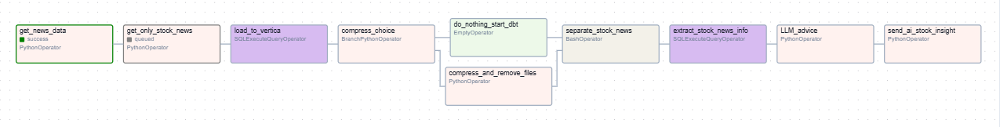

# Stock News Sentiment Analysis Pipeline

---

## Table of Contents
1. [Project Overview](#Project-Overview)
2. [Technical Architecture](#technical-architecture)
3. [Directory Structure of Main Project Folder](#directory-structure-of-main-project-folder)
4. [Implementation Details](#implementation-details)
5. [DAG Structure](#dag-structure)
6. [Reproducing this Project](#reproducing-this-project)
7. [Testing & Debugging](#testing--debugging)
8. [Monitoring & Maintenance](#monitoring--maintenance)
9. [Future Enhancements](#future-enhancements)
10. [Contributing](#contributing)

---

## Project Overview
This project features an end-to-end pipeline that automates the collection, processing and analysis of news related to the stock market and delivers stock sentiment insights. 

Using Apache Airflow to orchestrate tasks, it retrieves news data from NewsAPI, processes and classifies the articles using natural language processing (NLP) and machine learning, loads the data into a Vertica database, compresses historical data as needed, runs dbt for further transformation, and finally leverages Gemini AI to generate summarized analysis that is sent via email.
The initial set of articles were classified into stock related and non stock related using a deep learning model `FacebookAI/roberta-large-mnli` which served as our labeled dataset. After which `lightgbm` model was pretrained using traditional NLP techniques (Bag of Words, TFIDF for vectorization and ngrams of 1) for a more efficient modeling. 

## Technical Architecture

### Core Components
1. **Data Collection Layer**
   - NewsAPI integration for real-time news fetching
   - BeautifulSoup4 for article content extraction
   - Error handling for failed requests with fallback to article descriptions
   - Idempotent execution support for backfilling

2. **Machine Learning Layer**
   - TF-IDF Vectorization (300 features)
   - LightGBM classification model
   - NLTK for text preprocessing
   - Cloudpickle for model serialization

3. **Data Storage & Processing**
   - Vertica as the primary database
   - dbt for data transformation
   - JSON Lines format for data exchange
   - Monthly data archival system

4. **AI Analysis Layer**
   - Google Gemini 2.0 Flash model integration
   - Custom system prompts for stock analysis
   - Structured insight generation

5. **Notification System**
   - Gmail SMTP integration
   - UTF-8 encoded email support
   - Formatted daily reports

## Prerequisites

### API Keys & Credentials
1. NewsAPI Key
2. Google Gemini API Key
3. Gmail App Password for SMTP

### System Requirements
- Python 3.11+
- Apache Airflow 2.0+
- Vertica Database
- dbt Core
- Docker environment


### Python Dependencies
These can also seen in the requirements.txt file of the `docker_configs` dir of this repo.
```bash
protobuf==4.25.3 # Required for specific compatibility
dbt-core==1.7.3
dbt-vertica==1.7.3
joblib==1.4.2
nltk==3.9.1
cloudpickle==3.1.1
scikit-learn==1.6.1
beautifulsoup4==4.12.3
numpy==1.26.3
pandas==2.1.4
Markdown==3.5.2
apache-airflow-providers-vertica==3.8.0
apache-airflow-providers-common-sql==1.19.0
lightgbm==4.5.0
sqlparse==0.4.4
```

## Directory Structure of Main Project Folder
```
project_root/
├── data/                    # Raw news data organized by month
│   └── YYYY-MM/            # Monthly folders
│       └── YYYY-MM-DD_news_file.txt
├── labeled_data/           # ML-processed data
│   └── YYYY-MM/           
│       └── YYYY-MM-DD_news_file_labeled.jsonl
├── models/                 # ML model files
│   ├── tfidf_vectorizer_300.pkl
│   └── lgb.joblib
├── compressed_data/        # Monthly archives
│   └── YYYY-MM_raw_news_data.zip
├── ai_analysis/           # Gemini outputs
│   └── YYYY-MM/
│       └── YYYY-MM-DD_llm_advice.txt
└── dbt_project/          # dbt transformations
    └── models/
        ├── Stock_News.sql
        └── Non_Stock_News.sql
```

## Implementation Details

### Data Collection
```python
def connect_to_api_csv(**context):
    exec_datetime = context["execution_date"]
    exec_date = exec_datetime.strftime("%Y-%m-%d")
    
    # API connection with error handling
    url = f"https://newsapi.org/v2/everything?from={exec_date}&to={exec_date}&language=en&q=(market OR stock)&apiKey={api_key}"
    response = requests.get(url)
    articles = response.json()['articles']
    
    # Content extraction with fallback
    for article in articles:
        content = get_full_article(article['url'])
        if content is None:
            content = article['description']
```

### Machine Learning Pipeline
```python
def filter_news(** ):
    # Load pre-trained vectorizer
    with open(f"{model_path}/tfidf_vectorizer_300.pkl", "rb") as f:
        tfidf_loaded = cloudpickle.load(f)
    
    # Transform and predict with pretrained lgbm mdodel
    char_array = tfidf_loaded.transform(df.content).toarray()
    frequency_matrix = pd.DataFrame(char_array, 
                                  columns=tfidf_loaded.get_feature_names_out())
    model = load(f"{model_path}/lgb.joblib")
    model_pred = model.predict(frequency_matrix)
```

### Data Archival System
The pipeline implements a sophisticated data archival system:
1. Checks execution date for month-end
2. Compresses entire month's data if at month-end
3. Maintains data accessibility for backfilling
4. Automatically cleans up original files after compression

```python
def compress_choice(**context):
    exec_datetime = context["next_execution_date"]
    exec_day = exec_datetime.day
    return 'compress_and_remove_files' if exec_day == 1 else 'do_nothing_start_dbt'
```

### dbt Implementation
The project uses dbt for data transformation with incremental loading with model files being dynamically generated.

1. **Stock News Model**
```sql
{{ config(materialized='incremental', unique_key='content') }}
select * from News_DB.Full_News_Table 

    where label = 1 and date = {{ ds }}

```

2. **Dynamic Model Generation**
```bash
rm {{ params.stock_path }} {{ params.non_stock_path }} &&
echo "{{ dbt_model_content }}" >> {{ params.stock_path }}
```

### AI Analysis Integration
```python
def LLM_advice(**context):
    sys_instruct = "You are a Stock Sentiment Analyst..."
    client = genai.Client(api_key=gemini_api_key)
    
    # Extract stock news from Vertica
    news = context["task_instance"].xcom_pull(
        task_ids="extract_stock_news_info", 
        key="return_value"
    )
    
    # Generate insights
    response = client.models.generate_content(
        model="gemini-2.0-flash",
        config=types.GenerateContentConfig(
            system_instruction=sys_instruct
        ),
        contents=[news_prompt + news_as_text]
    )
```

## DAG Structure



*Figure: High-level architecture of the Stock Sentiment Analysis pipeline*


## Reproducing this Project
I compiled all the codes and model files I created into a single image and have made that accessible on docker hub. Find below the steps to replcate.
1. Make a clone of this repo
2. Start the Docker deskop application
3. Navigate to the `docker_configs` dir from powershell or preferred command line interface.
4. Run the below which will pull the created custom image as well as the vertica DB community edition image. 
   ```bash
   docker compose up
   ```
### API Section
5. Generate an API key from [NewsAPI](https://newsapi.org/).
6. Generate free API key from [Google Gemini](https://ai.google.dev/gemini-api/docs/api-key).
7. Populate airflow variables with below configuration commands in the airflow container. Note: These can also be set via the airflow UI
   ```bash
   # Email Configuration
   airflow variables set email_vars '{
      "smtp_user": "your_email@gmail.com",
      "smtp_password": "app_specific_password",
      "smtp_url": "smtp://smtp.gmail.com:587"
   }' -j --description "These are the email variables"

   # API Keys
   airflow variables set NEWS_API_KEY "your_key"
   airflow variables set GEMINI_API_KEY "your_key"
   ```
### Vertica Section
8. In the Vertica container, navigate to the vsql tool by running the below command.
   ```bash
   /opt/vertica/bin/vsql
   ```
9. Create a new schema within the default DB created `VMart` with the following commands.
   ```sql
   CREATE SCHEMA News_DB DEFAULT INCLUDE SCHEMA PRIVILEGES;
   CREATE TABLE News_DB.Full_News_Table (date date, content LONG VARCHAR, label int);
   CREATE TABLE News_DB.Stock_News like News_DB.Full_News_Table;
   CREATE TABLE News_DB.Non_Stock_News like News_DB.Full_News_Table;
   ````

10. Configure Airflow Connection. It'll be better to set this via GUI. 
      ```
      Navigate to Admin>>connections

      Since the docker compose file creates a network and the vertica service name is "vertica". Create a new connection with Host named vertica and set the following parameters. Essentially, the service name becomes the Host name.

      Connection id=vertica
      Connection type=Vertica (this should be a drop down)
      Host=vertica
      Schema=VMart
      Login=dbadmin
      Password=(leave empty as Vertica default user has no password)
      Port=5433
      ```
### DBT Section
11. The profiles.yml which is added to the custom image contains the host credentials and you don't have to worry about that.
### Email Section
12. The email task used the airflow's default `send email` function and thus, relevant email sections in the `airflow.cfg` must be updated with the below commands. You can directly make the relevant changes in the `[smtp]` section of the file. Configure the following parameters.
      ```bash
      smtp_host = smtp.gmail.com
      smtp_starttls = True
      smtp_user = user@gmail.com
      smtp_password = <pwd>
      smtp_port = 587
      smtp_mail_from = user@gmail.com
      ```
## General 
13. Turn on the DAG in airflow and receive amazing news insights directly in your mail box. (Add image below)


## Testing & Debugging

### Common Issues

1. **Vertica Connection**: After configuring your connection details, you can test it via commands. If you run into an error, try enabling this parameter and test again.
   - Enable connection testing `export AIRFLOW__CORE__TEST_CONNECTION=Enabled`
   - Test connection: `airflow connections test vertica`

2. **API Limits**
   - The free plan of NewsAPI is limited to only the past 30 days

3. **Data Persistence**
   - Verify mounted volumes
   - Check file permissions
   - Monitor disk space

4. **DBT Issues**
   - Validate model files exist
   - Check incremental logic
   - Verify table permissions

5. **News Collection Fails**
   ```bash
   airflow tasks test Stock_sentiment_analysis get_news_data 2024-02-11
   ```

6. **ML Processing Issues**
   - Check model files exist
   - Verify NLTK downloads
   - Review input data format


## Monitoring & Maintenance

1. **Daily Monitoring**
   - Check Airflow task status
   - Verify email delivery
   - Monitor API quotas

2. **Monthly Tasks**
   - Verify data archival
   - Check compression ratios
   - Audit storage usage

3. **Quarterly Maintenance**
   - Update API keys
   - Retrain ML models
   - Review system performance

## Future Enhancements

1. **Technical Improvements**
   - Implement parallel processing for news fetching
   - Add more sophisticated NLP preprocessing
   - Enhance error handling and retry logic

2. **Feature Additions**
   - Add support for multiple news sources
   - Implement sentiment strength scoring
   - Create interactive dashboard

3. **Infrastructure**
   - Add monitoring and alerting
   - Implement automated backups
   - Add CI/CD pipeline

## Contributing

1. Fork the repository
2. Create feature branch
3. Follow PEP 8 guidelines
4. Add appropriate tests
5. Submit pull request